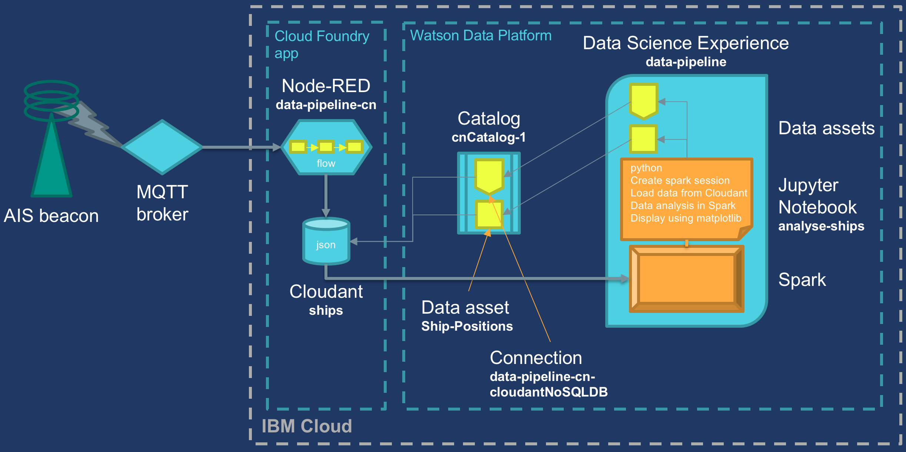
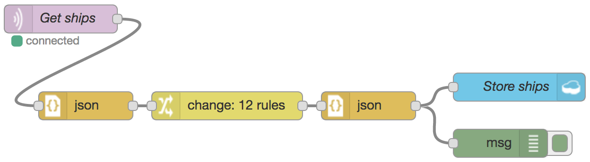

# Building an end-to-end data pipeline
This prototype project shows how to build an end-to-end data pipeline to enable smarter decisions.  It is built in the IBM Cloud using an Internet of Things scenario.

A description of the demonstration can be found at:

The data pipeline

The project uses the following IBM Cloud services: Node-RED, Cloudant, Catalog, Data Science Experience, Spark and Watson Data Platform.

This repo contains the following:
- Ingest-Flow - a Node-RED flow to ingest data
- Show-Data - a Node-RED flow that displays the stored data in a browser
- Analyse-Ships.ipynb - a notebook of the data access for analysis
- Analyse-Ships.py - a text version of the Python code

The Node-RED ingest flow

The notebook shows how to access the data stored in Cloudant using the catalog service, analyse it in Spark, and display the ship positions on a simple graph using matplotlib.

## Contact
This project was put together by Chris Nott in January 2018.
